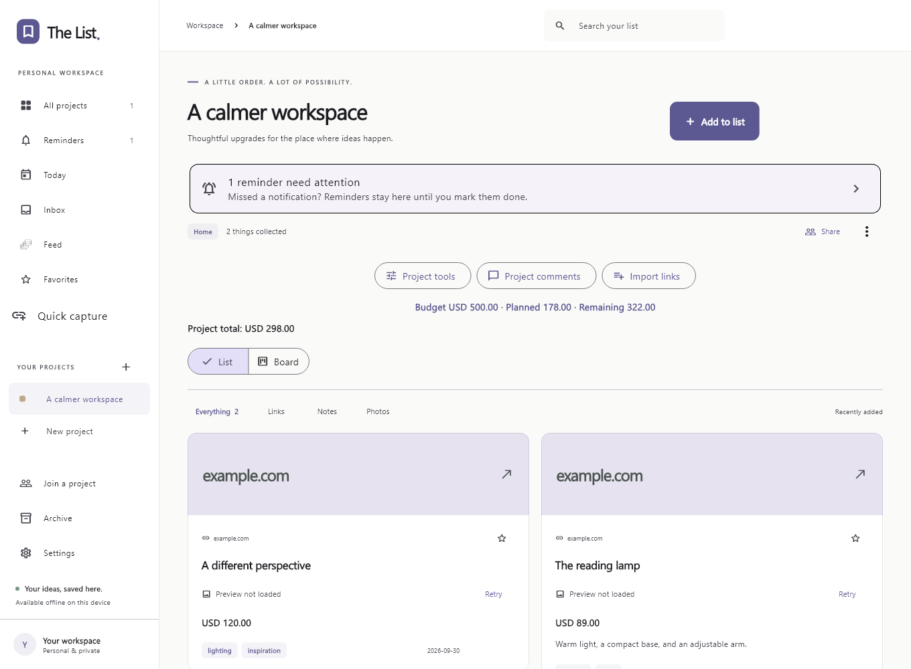

# The List

A native app for collecting project links, notes, photos, and reminders, with optional encrypted sharing. Keep your ideas on your own device, organize a project, and share it with the people working on it.



_The actual Flutter interface, rendered with sample data. New installations start empty._

[Illustrated user guide](docs/USER_GUIDE.md) · [Windows release builds](docs/WINDOWS_RELEASES.md) · [Sharing service deployment](server/DEPLOYMENT.md) · [Verification notes](VERIFICATION.md)

## Features

- Projects with descriptions, categories, cover photos, archive, and recoverable deletion.
- Links with previews, notes, photo attachments, tags, search, and favorites.
- Boards with custom columns, checklists, assignments, purchase comparisons, quantities, and budgets.
- Personal reminders, repeating schedules, snooze, and a Today view.
- Reviewed link capture from the browser extension and supported native share targets.
- Shared conversations, a received activity feed, and owner-controlled read-only or update access.
- Encrypted direct synchronization, optional encrypted offline delivery, field-level conflict review, and note history.
- Portable backups, daily Excel backups, project PDF exports, and reusable structure templates.

You can use the app without an account or a sharing service. Edits persist locally; sharing is optional.

## Get started on Windows

1. Open this repository's **Releases** page and download a published `The-List-<version>-Windows-x64.zip`. Release availability depends on the maintainer publishing a build. Maintainers can also download a build from **Actions → Windows release → Artifacts**.
2. Extract the entire ZIP to a permanent folder. Keep the executable, DLLs, and `data/` directory together.
3. Install the [Microsoft Visual C++ x64 Redistributable](https://learn.microsoft.com/en-us/cpp/windows/latest-supported-vc-redist) if the runtime is missing.
4. Run `the_list.exe`, select **New project**, and use **Add to list** to save your first item.

The ZIP contains the illustrated guide and browser extension. There is no installer or automatic updater. For an upgrade, export a backup, close the app, and extract the new version into a separate folder. Your workspace is stored outside the executable folder; **Settings** shows its exact location. Re-enable browser capture and save daily backup settings if the executable moves.

See the [user guide](docs/USER_GUIDE.md) for installation, daily use, sharing, recovery, and troubleshooting.

## Sharing and offline changes

Configure the same connection service on both devices under **Settings → Connection settings**. The owner chooses **Read only** or **Can update**, creates a single-use invitation, and sends it privately. Invitations expire after 15 minutes and contain the project's pairing key.

When both apps are open, changes and photos sync directly. With **Encrypted offline delivery** enabled by both peers, the service can temporarily hold encrypted text updates for up to 30 days. Photos still need a direct connection. Pending changes remain on the originating device if delivery is unavailable.

Separate fields merge independently. Competing edits to one field converge using a logical version and deterministic tie-breaker; a wall-clock timestamp does not decide the winner. **Project tools → Activity and conflict review** lets you keep the current value or apply an alternative. Note **Version history** preserves earlier bodies. The app does not merge individual sentences in a note.

Run a local connection service with Node.js 22 or newer:

```sh
cd server
npm start
```

For two apps on the same computer, use `http://127.0.0.1:5174`. Other devices need a reachable service; for internet use, follow the [HTTPS and TURN deployment guide](server/DEPLOYMENT.md). A release does not provision a public service. Permission-aware sharing requires app version 1.2.0 or newer on every participant and the matching server.

## Build and contribute

The project currently uses **Flutter 3.47.5**. Install Flutter and the platform toolchain before building. Windows requires Visual Studio with the **Desktop development with C++** workload; see [Flutter's Windows setup](https://docs.flutter.dev/platform-integration/windows/setup).

```sh
cd native
flutter pub get
dart format --output=none --set-exit-if-changed lib test integration_test tools test_driver
flutter analyze
flutter test
flutter run -d windows
```

To compile and package a Windows release, run these commands from the repository root in PowerShell:

```powershell
Push-Location native
flutter pub get
flutter build windows --release
Pop-Location
./scripts/package-windows.ps1
```

The [Windows release workflow](.github/workflows/windows-release.yml) runs the app checks, builds the x64 runtime, and creates a versioned ZIP and SHA-256 checksum. Successful manual runs and matching version-tag builds **automatically publish a GitHub release** with both files. Manual runs create a missing version tag at the exact built commit; prerelease versions publish as prereleases. See [release instructions](docs/WINDOWS_RELEASES.md) for versioning, endpoint configuration, and publication.

Other platform commands, run from `native/`:

```sh
flutter build apk --release
flutter build linux --release
flutter build macos --release
flutter build ios --release --no-codesign
```

Android APKs use development signing unless `native/android/key.properties` supplies release credentials. Store bundles need that signing configuration. Apple builds require macOS, Xcode, provisioning, and a signing team; the CI iOS build is unsigned. Linux requires GTK, Ninja, CMake, pkg-config, libsecret development headers, and a C++ toolchain. Apple/Linux behavior and public-network TURN still need platform/deployment acceptance testing; inspect [verification notes](VERIFICATION.md) before distributing them.

For signaling and browser changes, run from `server/`:

```sh
npm ci --ignore-scripts
npm run format
npm run format:check
npm test
```

The server has no runtime npm dependencies. Prettier is used for development. Run `python native/tools/test_linux_reminder.py` from the root for the Linux helper tests. Comments in maintained code explain merge rules, permissions, export snapshots, and platform lifecycle behavior.

Windows integration tests require a running signaling service:

```sh
cd native
flutter test integration_test/sync_test.dart -d windows
flutter test integration_test/reminders_test.dart -d windows
```

The sync test accepts `--dart-define=THE_LIST_TEST_SIGNAL_URL=http://127.0.0.1:PORT` for an isolated service. General multi-platform CI remains in [build.yml](.github/workflows/build.yml).

## Data and privacy

The database and photos live in the device's application-support folder. SQLite is not separately encrypted at rest; OS account permissions and disk encryption protect local files. Pairing keys use OS secure storage and are excluded from portable backups. Exported backups and Excel/PDF files should be stored privately.

Reminders and read/unread state are personal to each device. Turning off sharing does not erase copies another participant already received. Optional link previews contact the saved website. The [user guide](docs/USER_GUIDE.md#data-privacy-and-limits) documents retention, photo conversion, backup limits, and platform notification behavior.

## Repository layout

| Path                 | Contents                                                                |
| -------------------- | ----------------------------------------------------------------------- |
| `native/`            | Flutter app, platform projects, tests, and local Windows plugin patches |
| `server/`            | Node signaling service, tests, and deployment configuration             |
| `browser-extension/` | Unpacked Chrome/Edge capture extension                                  |
| `docs/`              | Illustrated user guide and Windows release instructions                 |
| `scripts/`           | Windows release packaging and publication                               |
| `.github/workflows/` | Build checks and release automation                                     |
| `screenshots/`       | App screenshots and Flutter widget renders                              |

Generated `dist/`, `releases/`, build outputs, credentials, and dependency caches are ignored. The [screenshot index](screenshots/README.md) records how the images were captured.
