# The List user guide

This guide covers The List 1.2.1. It follows a small workspace project from saving the first idea through planning, sharing, and backup. The same steps work for research, shopping, travel, or a project with friends.

The pictures show the actual app interface rendered with isolated sample data. Older pictures use a different example project or accent color. Phone pictures demonstrate the responsive layout; they are not photographs of an iPhone. Your installation starts empty.

## Contents

- [Install and update on Windows](#install-and-update-on-windows)
- [Your first ten minutes](#your-first-ten-minutes)
- [Find your way around](#find-your-way-around)
- [Create and maintain projects](#create-and-maintain-projects)
- [Save links, notes, and photos](#save-links-notes-and-photos)
- [Capture from a browser or phone](#capture-from-a-browser-or-phone)
- [Plan with boards, checklists, and assignments](#plan-with-boards-checklists-and-assignments)
- [Compare purchases and track a budget](#compare-purchases-and-track-a-budget)
- [Use reminders and Today](#use-reminders-and-today)
- [Share a project](#share-a-project)
- [Understand offline updates and conflicts](#understand-offline-updates-and-conflicts)
- [Follow conversations and shared activity](#follow-conversations-and-shared-activity)
- [Back up, export, and recover](#back-up-export-and-recover)
- [Adjust your workspace](#adjust-your-workspace)
- [Data, privacy, and limits](#data-privacy-and-limits)
- [Troubleshooting](#troubleshooting)

## Install and update on Windows

### First installation

1. On the GitHub repository, open **Releases** and choose a published Windows x64 release. If the maintainer has not published one yet, there may only be build artifacts under **Actions → Windows release**. Artifact downloads generally require signing in to GitHub.
2. Download the versioned Windows ZIP and extract it completely. A folder such as `Documents\The List App` makes it easy to find again.
3. Run `the_list.exe` from the extracted folder. Do not run it inside the ZIP or copy only the executable: the adjacent DLLs and `data/` folder are required.
4. If Windows reports a missing Visual C++ runtime, install the [Microsoft Visual C++ x64 Redistributable](https://learn.microsoft.com/en-us/cpp/windows/latest-supported-vc-redist), then try again.
5. Keep this application folder in a stable location if you enable browser capture or scheduled Windows backups.

The release is a folder-based application, with no installer or automatic updater. This build process does not code-sign the executable. Windows may show its normal reputation prompt for an unsigned download; verify that it came from the intended repository and release.

The ZIP contains this guide, its screenshots, and the unpacked browser extension. On GitHub, the guide displays inline pictures. In the downloaded package, use a Markdown viewer supporting relative images to read `docs/USER_GUIDE.md` with pictures.

### Update an existing installation

1. In the old app, use **Settings → Export workspace** and save the backup outside the application folder.
2. Close the app, extract the new release into a separate folder, and launch its executable.
3. Check that your projects appear. Your workspace is in the application-support directory rather than beside the executable. **Settings → Stored on this device** shows the actual path.
4. If you use browser capture, select **Settings → Enable browser capture** again after moving to the new executable.
5. If you use daily Windows backups, open **Daily Excel backup** and save its settings again so the scheduled task points to the current executable.

Keep the old application folder until you confirm the upgrade. Avoid running different versions against the same workspace at the same time.

## Your first ten minutes

1. Open **Settings → Your display name** and enter a recognizable name, such as Alex. Assignments use this name; it is not a sign-in account.
2. Select **New project**, enter a title such as _A calmer workspace_, and save. Add a description and category if useful.
3. Open the project, choose **Add to list**, select **Link**, and save a website with a title and a few tags.
4. Add a **Note** for your questions or a **Photo** for reference.
5. Open an item and select **Planning & comments** to add a checklist or assign it to yourself.
6. Select **Remind me** on the item and choose a date and time.
7. Visit **Today** to see your assigned item and reminders due today or earlier.
8. Use **Settings → Export workspace** to make your first portable backup.

You can do this without setting up sharing. Saved content remains available offline; visiting websites and fetching previews require a connection.

_A project brings reference material and planning tools together._

## Find your way around

On desktop, use the left sidebar. On a smaller screen, use the navigation controls or menu to reach the same views; buttons may wrap or move as space changes.

| View              | Use it for                                                                         |
| ----------------- | ---------------------------------------------------------------------------------- |
| **All projects**  | Open and create projects                                                           |
| **Reminders**     | Review personal reminders, complete them, or change their schedules                |
| **Today**         | Due/overdue reminders and items assigned to your display name                      |
| **Inbox**         | Captured ideas, incoming shared comments, and reminders needing attention          |
| **Feed**          | Changes received from other devices across shared projects                         |
| **Favorites**     | Find items you have starred                                                        |
| **Quick capture** | Review links or an idea before choosing where to save them                         |
| **Archive**       | Find projects you have put away                                                    |
| **Settings**      | Appearance, display name, tags, templates, backups, notifications, and connections |

Use search in project lists and Feed to find relevant content or received changes. Within a project, use **Everything**, **Links**, **Notes**, and **Photos** to filter item types. Use tags and clear titles to make later searches easier.

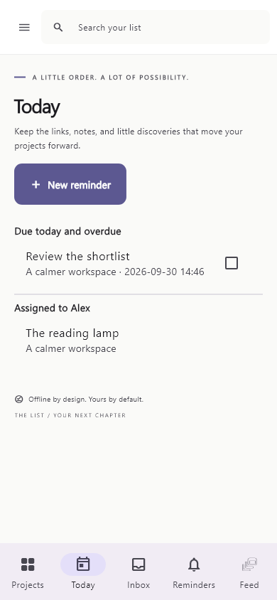

_The same Today view adapts to a phone-sized screen._

## Create and maintain projects

Select **New project** in the navigation or use the add control beside your projects. Enter a title, description, category, and color as needed. If you have saved a template, you can use it for the new project's structure.

Open the three-dot **Project options** menu to:

- **Edit project**: change its details.
- **Attach cover photo**: give it a visual reference.
- **Set a reminder**: create a personal reminder for the project.
- **Archive project**: put it away while keeping its contents.
- **Move to trash**: hide it after confirmation; recovery is available in Settings.

Open an archived project from **Archive** and choose **Restore project**. To recover a removed project or item, use **Settings → Restore deleted items**.

In a shared project, archiving, editing, and removal are project changes and can reach other participants. A read-only participant cannot make those changes. Archive and trash are not private filing actions on a shared project.

### Reuse a project structure

Choose **Project tools → Save as template** and name it. Templates reuse structure and tags, including board configuration, rather than copying items into the new project. Manage templates in **Settings → Project templates**.

For example, save a board with _Research_, _Shortlist_, and _Finished_ columns. A project based on it starts ready for its own content.

## Save links, notes, and photos

### Links

1. Open a project and select **Add to list → Link**.
2. Enter the URL and a useful title. Add a description and tags; add a price and currency if it represents a purchase.
3. Select **Save to list**.
4. Open the saved item to edit, plan, comment, or select **Visit website**.

Automatic previews try to retrieve a title, description, or image from the website. Some sites block previews or lack suitable metadata. The link remains usable without a picture. Use **Retry** if appropriate, or add your own description/photo. **Settings → Automatic link previews** controls fetching.

Capture normalizes common tracking parameters and flags duplicate URLs. Meaningful query values are retained. Check the destination and duplicate indicator before saving.

### Notes and revision history

Choose **Add to list → Note**, enter a title and body, and save. Open it again to edit. For an earlier body, select **Version history** in the detail view, review the saved revision, and choose **Restore**. Restoring writes a new current body; it does not erase intervening history.

If two people edit the same note body, the app preserves versions but does not combine paragraphs automatically. See [conflict handling](#understand-offline-updates-and-conflicts).

### Photos

Choose **Add to list → Photo**, select **Choose a photo**, give it a title, and save. Items can also have attached photos; use **Replace attached photo** when editing. The cover-photo action belongs to the project menu.

Photos are converted to JPEG, resized to at most 2,000 pixels on the longest edge, and stripped of EXIF metadata. Keep separate originals if you need full quality or metadata. Input supports JPEG, PNG, or WebP, up to 20 MB and 40 megapixels.

### Tags and favorites

Use consistent tags such as `lighting`, `research`, or `weekend`. In **Settings → Manage tags**, rename or merge tags as your vocabulary changes. Star useful items to find them in **Favorites**.

## Capture from a browser or phone

### Quick capture and bulk links

1. Open **Quick capture**, or choose **Import links** inside a project.
2. Paste URLs or enter an idea. Bulk capture accepts up to 100 URLs.
3. Review the proposed items and choose a destination. Your private Inbox is useful when you have not chosen a project.
4. Duplicates are disabled; open the existing item using its open icon to inspect it.
5. Select **Save selected**.

When viewing a read-only project, capture defaults to your private Inbox instead of that project.

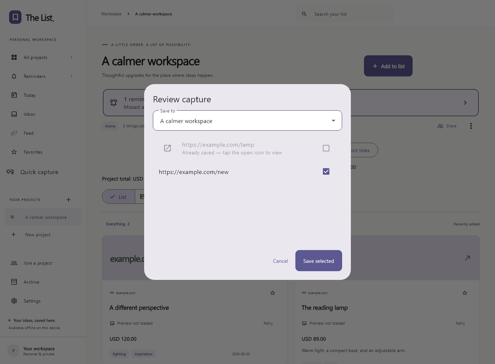

_Review the destination and selected links before saving._

Captured ideas appear in **Inbox → Captured ideas**. Open one to inspect it, then use its destination menu to move it into a project when ready.

### Chrome or Edge on Windows

1. Keep the app in the location from which you will normally run it.
2. Select **Settings → Enable browser capture** to register that executable.
3. Open the browser's **Extensions** page and enable **Developer mode**.
4. Choose **Load unpacked** and select `browser-extension` from the release ZIP or source repository.
5. Pin **Save to The List**. On a website, click it, then select **Review in The List**.
6. Choose a destination in the app's review screen and confirm.

If you move the app, enable browser capture again. Keep the extension folder too: an unpacked extension loads its files from that location. See [installation notes](../browser-extension/INSTALL.txt).

### Android and other platforms

With the Android app installed, share a link or text from another app and select **The List**. Incoming content opens a review flow rather than being silently added.

Linux capture needs registration with `native/linux/install-capture.sh /absolute/path/to/the_list`. The macOS bundle registers the capture URL scheme. iPhone sharing requires a signed, provisioned Share Extension configured on a Mac. Maintainer steps are in [Windows release instructions → Other platform setup](WINDOWS_RELEASES.md#other-platform-setup). These integrations have different validation status; see [verification notes](../VERIFICATION.md).

## Plan with boards, checklists, and assignments

### Put selected items on a board

1. Open a project and switch **List** to **Board**.
2. Use **Add existing item** to select project items, or **New card** to create one.
3. Drag cards between columns on desktop, or use a card's three-dot menu to choose a column or change its order.
4. In **Project tools → Manage board columns**, add, rename, or reorder columns. Move/remove cards before deleting their column.

Board membership is explicit. Saving to the project does not automatically add an item to the board. Removing from the board keeps it in the project's List; trash is a separate action.

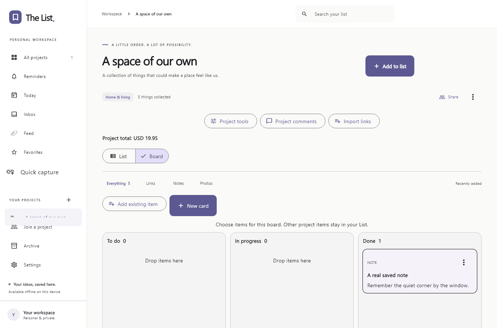

_Only selected items appear on the board._

### Add a checklist and assign an item

Open **Planning & comments** on an item. Add checklist entries and check them off as work finishes. Set **Assignee** to a person's display name; the item appears in their **Today** view when it matches their configured name, ignoring case.

Assignments are text labels, not accounts. Agree on names with collaborators. Renaming your display name does not automatically rename existing assignments.

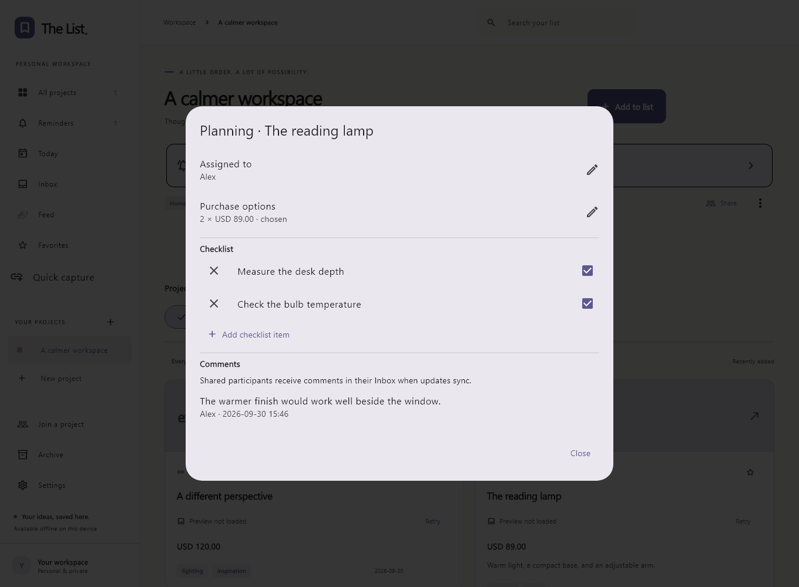

_Decisions, tasks, and discussion stay with the item._

## Compare purchases and track a budget

Save a purchase link's unit price and currency. In **Planning & comments**, set **Quantity**, **Purchase status**, and **Comparison group**. Give alternatives the same group, such as `Lighting`.

Open **Project tools → Compare purchase options** to compare alternatives. Choose the one you want, then update its status when ordered or received. Choosing is a planning decision; the app does not place orders or verify current merchant prices.

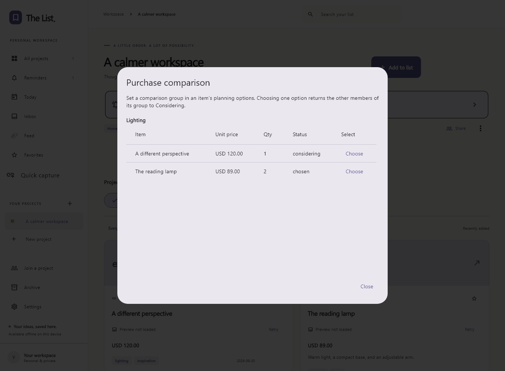

_Compare price and quantity before choosing._

Set a budget in **Project tools → Project budget**:

| Number            | What counts                                            |
| ----------------- | ------------------------------------------------------ |
| **Project total** | All priced links multiplied by quantity                |
| **Planned**       | Links explicitly marked Chosen, Ordered, or Received   |
| **Remaining**     | Budget minus planned spending in the budget's currency |

Two chosen lamps at USD 89 contribute USD 178 to planned spending. An unchosen USD 120 alternative contributes to the project total but not planned spending. Different currencies remain separate; there is no currency conversion. Enter prices manually when a preview cannot provide one, and check before buying.

## Use reminders and Today

1. On an item, select **Remind me**; on a project, use **Project options → Set a reminder**. You can also create one from **Reminders** or **Today** after creating a project.
2. Enter a title, date, time, and repeat schedule: none, daily, weekly, monthly, or weekdays. Due times use your current time zone.
3. Enable **Settings → Native notifications** and grant OS permission when prompted.
4. Review reminders in **Reminders**, **Today**, or the attention area in **Inbox**. Use the menu to edit, snooze for one hour, or delete.
5. Check a completed reminder. Repeating reminders advance to the next future occurrence; an unfinished occurrence stays visible.

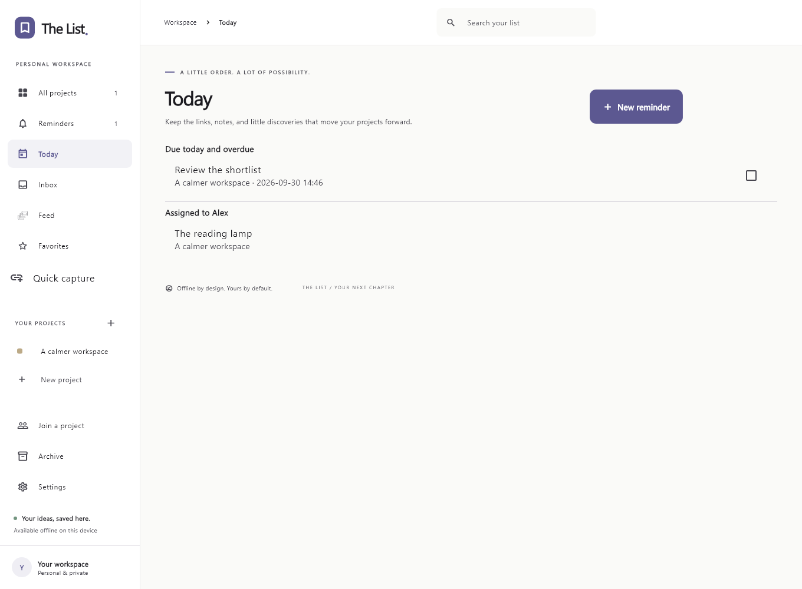

_Today shows reminders through the end of the current day and assigned items._

Reminders are personal to the device. Collaborators do not receive yours, and read-only participants can set their own. Due reminders stay visible until completed even if a notification was missed.

Windows, Android, and Apple use OS scheduling. Android timing is inexact to reduce battery use. iOS schedules the nearest 60 reminders and replenishes them on app use. Linux can use persistent systemd user timers with Python 3 and `notify-send`; otherwise delivery relies on the running app. OS permission, Do Not Disturb, login state, and scheduling affect delivery. Apple/Linux behavior still needs platform validation.

## Share a project

Sharing requires a service reachable by both devices. Ask the person maintaining your installation for its address. A public service is not included in the download. For self-hosting, see the [deployment guide](../server/DEPLOYMENT.md).

### Connect and invite

1. On both devices, open **Settings → Connection settings → Configure**.
2. Enter the service address and select **Check & save**. Internet sharing uses the deployed HTTPS address. `127.0.0.1` means the same computer and is only useful for local testing.
3. On the owner's device, open the project and select **Share**.
4. Choose **Read only** or **Can update**, then **Create invitation**.
5. **Copy invitation** and send it privately to the intended participant.
6. On the recipient's device, select **Join a project**, paste it, and choose **Join project**.
7. Keep both apps open for initial direct sync, especially photos. Inspect **Project tools → People and connection status** or use **Reconnect**.

Invitations are single-use and expire after 15 minutes. Create a fresh one if expired or used. They contain pairing information and an encryption key: treat them as private.

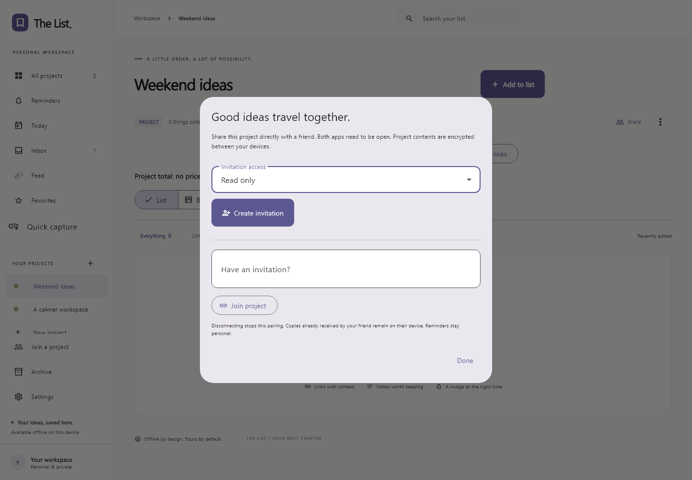

_Choose access before creating the invitation._

### Access and devices

| Access         | Allowed actions                                                   |
| -------------- | ----------------------------------------------------------------- |
| **Read only**  | Browse content/conversations, visit links, set personal reminders |
| **Can update** | Also add, edit, remove, plan, and comment                         |
| **Owner**      | Manage the project, issue invitations, and change pairing access  |

Only the owner issues invitations. In **Share**, use the shield beside a pairing to change its access. All participants need version 1.2.0 or newer and the matching service before relying on these controls.

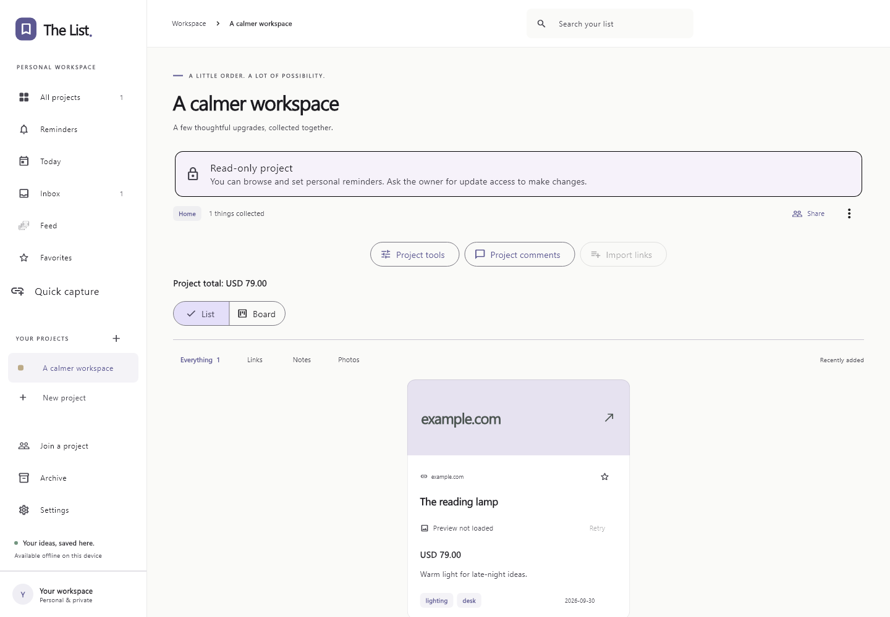

_The banner explains why editing controls are unavailable._

Pairings identify devices. A person's phone and computer are separate participants even with identical display names. Pairing keys use OS secure storage and do not travel in portable backups. Establish fresh pairings after moving to another device or restoring a backup as needed.

Connected apps learn access changes on their next signaling poll; offline upload permissions change at the service immediately. A disconnected guest may retain local edits made before learning of a downgrade, but they cannot update the owner while access is read-only. Stopping sharing prevents future delivery through that pairing; it cannot erase received copies. Service pairings expire after 90 days of inactivity. Local content remains available.

## Understand offline updates and conflicts

### One person is offline

Suppose Alex and Jordan have paired a project, and Jordan closes the app:

1. Alex changes a price. The value and its change record are saved locally immediately.
2. If both have enabled **Project tools → People and connection status → Encrypted offline delivery**, Alex's running app can upload an encrypted text update. Otherwise it waits for direct sync.
3. The service holds encrypted updates for up to 30 days. It cannot decrypt project contents, but handles pairing, routing, and delivery metadata.
4. When Jordan opens the app online, it polls, decrypts updates locally, and saves them before acknowledging delivery.
5. Jordan sees the received change in the project and **Feed**. Repeated delivery of the same change does not create another edit.

The app checks periodically while running, roughly every 15 seconds; delivery is not guaranteed to be immediate. A switched-off device runs no app. If the server is unreachable or an update expires, the originating device's retained history can be exchanged at the next direct connection. Leave both apps open while reconnecting.

**Photos transfer directly**, not through the mailbox. Text may arrive before a photo, which needs both apps directly connected later. Personal reminders remain on their own device.

### Two people change different fields

If Alex changes a price while Jordan changes its description, both can survive: fields merge independently. The app tracks change records rather than replacing the whole project each time peers connect.

### Two people change the same field

If both change the same price before receiving each other's edits, only one can be current. A logical change counter determines the winner, followed by stable device/change identifiers when counters tie. Computer clocks do not decide it. Peers converge after receiving the same changes.

To review a competing value:

1. Open the affected project.
2. Choose **Project tools → Activity and conflict review**.
3. Read the current and alternative values.
4. Choose **Keep current**, or, with update access, **Use alternative**.

Using the alternative writes a fresh change that can sync. Keeping the current value resolves that local review. For notes, **Version history** shows earlier full bodies and lets you restore one. The app does not perform character-by-character or paragraph-by-paragraph collaboration. Agree on a final note if both bodies contain useful text.

## Follow conversations and shared activity

Use **Project comments** for project-wide discussion, or an item's comments/planning view for its conversation. Comments use the same encrypted connections and delivery rules as updates.

Incoming comments appear in **Inbox → Shared comments**. Open an entry to view its conversation and mark it read. The check control marks it read without opening; read entries can be marked unread. Read decisions are private to this device.

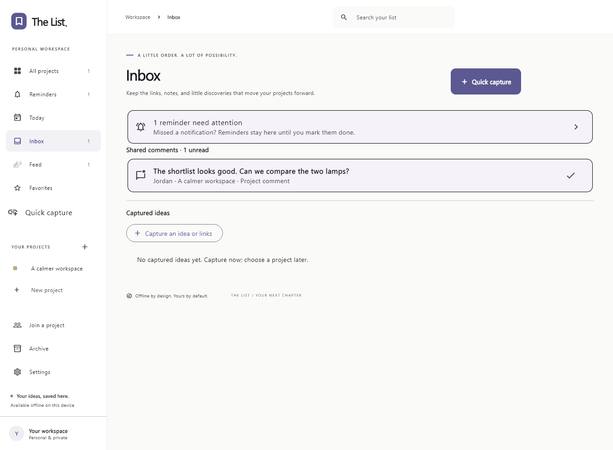

_Shared comments and captured ideas have separate Inbox areas._

Your originating device does not create an incoming notification for its own comment. Your separately paired device may receive one, because receipts use device identity rather than names. Existing conversations stay readable; backup restoration does not manufacture new comment alerts.

Open **Feed** for received additions, edits, pricing, board moves, checklists, comments, and removals. Select a card to open its item/conversation, search to filter, or choose **Mark all read**.

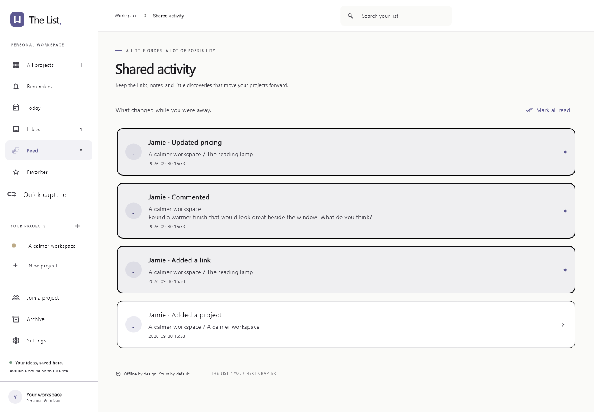

_Feed shows what changed while you were away._

The feed shows the latest 500 received records. Your own relayed changes, preview housekeeping, personal reminders, and backup restoration do not create entries. Initial pairing can include earlier history. Previously received operations are not backfilled when upgrading to Feed.

## Back up, export, and recover

Sharing does not replace backup: edits and removals can spread to peers. Keep a separate portable backup before upgrades or major cleanup.

### Export a portable workspace backup

1. Select **Settings → Export workspace**.
2. Save the `.thelist` file somewhere safe.
3. Copy it to a separate device or backup location as needed.

It contains project data, history, available referenced photos, and templates. Pairing keys are excluded. Photos are the app's prepared JPEGs, not necessarily original camera files. Portable backups support up to 100 MB of photos; import also limits the whole file to 200 MB.

For larger workspaces, close the app and copy the full application-support folder shown in Settings as an additional filesystem backup. Pairing keys live separately in secure storage; a folder copy is not a complete identity migration.

### Schedule daily Excel and portable backups on Windows

1. Open **Settings → Daily Excel backup**.
2. Select the backup folder and daily time.
3. Enable automatic backup and choose retention: **Forever** by default, or 30 days, 90 days, or one year.
4. Choose **Save & back up now** for an immediate backup, or **Save settings** for the schedule.
5. Periodically select **Verify latest backup** to check files against saved hashes.

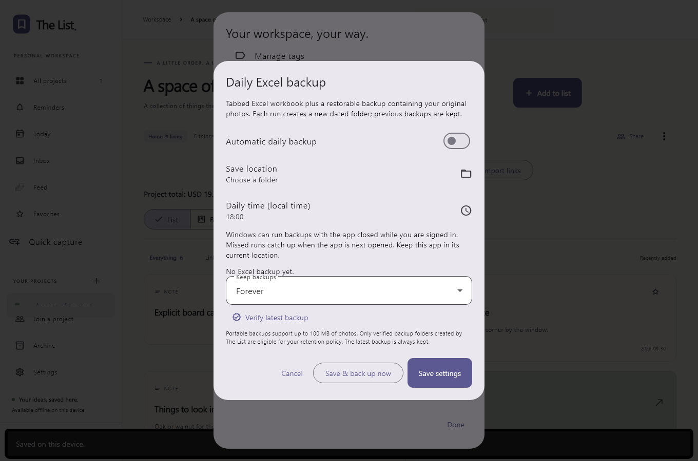

_Each run creates a dated folder with a workbook and portable backup._

The workbook is for inspection; restore using its `.thelist` companion. Each completed backup records hashes for both outputs. Retention removes only old, intact app-owned backup folders; it preserves the latest and folders whose files changed. Verification checks integrity rather than your choice of projects to restore.

The Windows task runs for the logged-in user and can catch up on a missed run. Keep the executable and destination available. Save settings again after moving the executable. A powered-off computer cannot back up at the scheduled moment.

### Export one project

Choose **Project tools → Export this project**. Formats include Excel, a readable PDF summary, and a portable project backup. Excel/PDF share a reference copy; the portable format preserves photos and history for restoration. PDF provides text, links, prices, tags, checklists, and comments rather than a photo album.

### Restore selected projects

1. Back up the current workspace first.
2. Choose **Settings → Import backup** and select a `.thelist` file.
3. Review names and item counts, then select projects to merge.
4. Select **Also merge saved project templates** if wanted.
5. Choose **Restore selected** and inspect the resulting projects.

Import merges rather than replacing the workspace. Newer field versions win, so an older file is not a guaranteed rollback. Use **Version history** or conflict review to write an earlier value as a new change. On a new device, restore into an empty workspace and establish fresh pairings as needed.

### Recover something from trash

In **Settings → Restore deleted items**, find it under **Recently removed** and select **Restore**. Archived projects are recovered from **Archive**. Shared-project restoration is an update requiring edit access and can sync to peers.

## Adjust your workspace

Choose **Dark appearance** and an **Accent color** in Settings. Change display name, manage tags, and maintain templates as needed.

Disable **Automatic link previews** to avoid fetching website metadata. Enable/disable **Native notifications** separately from creating reminders; reminders remain visible when notifications are disabled.

Configure **Connection settings** once per installation. A maintainer may bundle a service address. **Stored on this device** shows the workspace folder for storage checks or a closed-app copy.

## Data, privacy, and limits

| Topic                | Behavior                                                                      |
| -------------------- | ----------------------------------------------------------------------------- |
| Local storage        | SQLite/photos in application support; no separate database encryption at rest |
| Local protection     | OS account permissions and disk protection apply                              |
| Pairing secrets      | OS secure storage; excluded from portable backups                             |
| Sharing              | Contents encrypted for peers; service sees routing/delivery metadata          |
| Offline delivery     | Both opt in; encrypted text held for up to 30 days                            |
| Photos               | Direct sync; prepared JPEGs up to 2,000 pixels on the longest edge            |
| Input images         | JPEG, PNG, WebP; up to 20 MB and 40 megapixels                                |
| Portable backup      | Up to 100 MB of photos; import file limit 200 MB                              |
| Bulk capture         | Up to 100 URLs per review                                                     |
| Feed                 | Latest 500 received records                                                   |
| Reminders/read state | Personal to the device                                                        |
| Stop sharing         | Stops future delivery; does not retract received copies                       |

Keep exports, backups, and invitations private. Exported files are readable by anyone with access. Removing the executable folder does not remove saved work. Manage local data separately at the location shown in Settings, and close the app before copying database files.

## Troubleshooting

| Symptom                                          | What to check                                                                                         |
| ------------------------------------------------ | ----------------------------------------------------------------------------------------------------- |
| Windows app will not start                       | Extract the entire ZIP, keep DLLs and `data/`, install the x64 Visual C++ runtime if missing          |
| No projects on a new computer                    | Import a backup or join a shared project; workspaces do not follow a sign-in                          |
| Link has no picture                              | The site may block previews; retry, add a photo, or use the fallback                                  |
| Board looks empty                                | Select **Add existing item**; items do not automatically become cards                                 |
| Planned spending differs from total              | Check Chosen/Ordered/Received status, quantity, and currency                                          |
| Assigned item missing from Today                 | Compare the assignee with your display name                                                           |
| No notification                                  | Check app/OS permission, Do Not Disturb, login, and platform scheduling; the reminder remains visible |
| Browser capture fails or opens an old executable | Re-enable capture from the current app location and keep the extension folder                         |
| Invitation fails                                 | Check service address, expiry, single-use status, and app/server versions; create a new invitation    |
| Sharing disconnected                             | Open both apps, inspect connection status, reconnect; internet use may need TURN                      |
| Text arrived without a photo                     | Both apps need a direct connection for photos                                                         |
| Editing controls disabled                        | Ask the owner for update access to a read-only project                                                |
| Another value replaced yours                     | Review conflicts or note history and apply the intended value with update access                      |
| Old backup did not undo an edit                  | Import merges by version; restore the intended value as a fresh change                                |
| Backup verification failed                       | Preserve the folder, check for moved/edited files, create and verify a fresh backup                   |
| Scheduled backup stopped after moving the app    | Save its settings again from the current executable                                                   |

For a problem report, include app version, platform, exact action, error message, and project access. Redact invitations, pairing information, private links, and backup contents from public issues.
